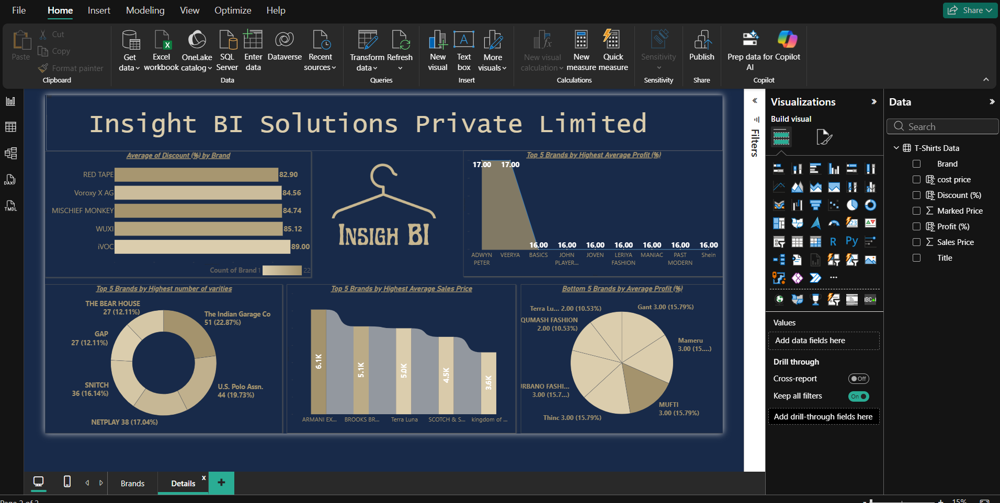
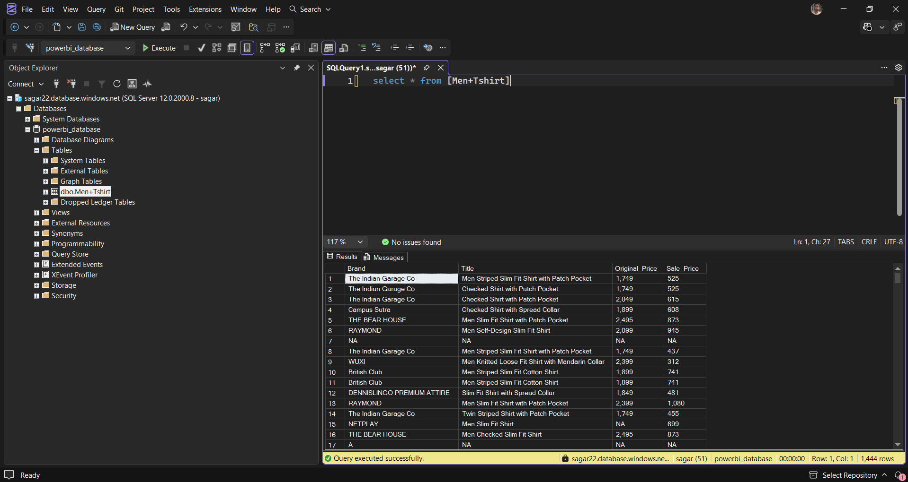
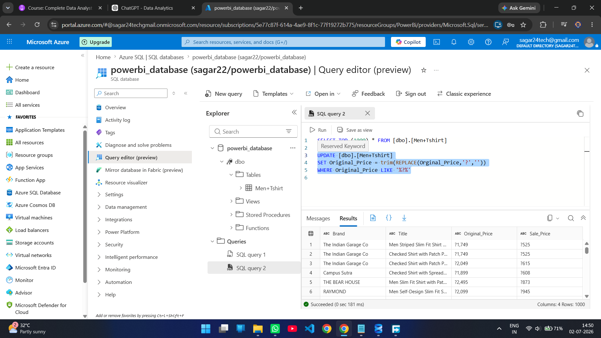
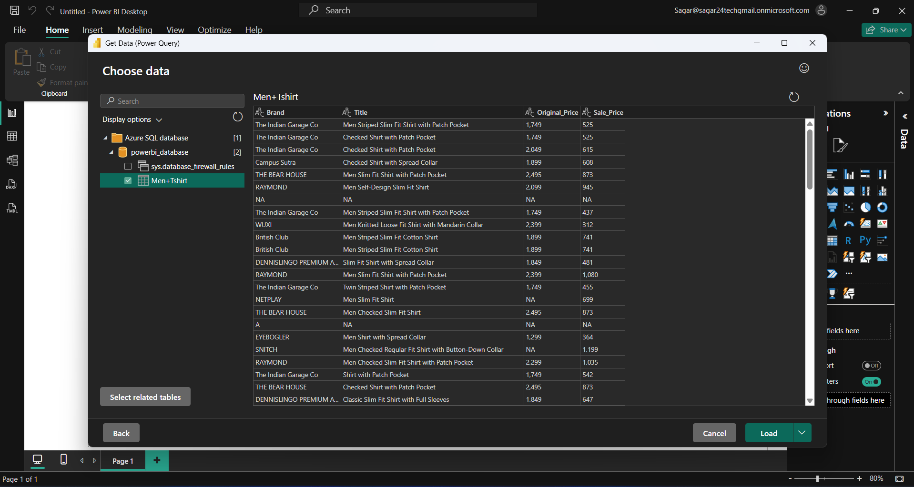
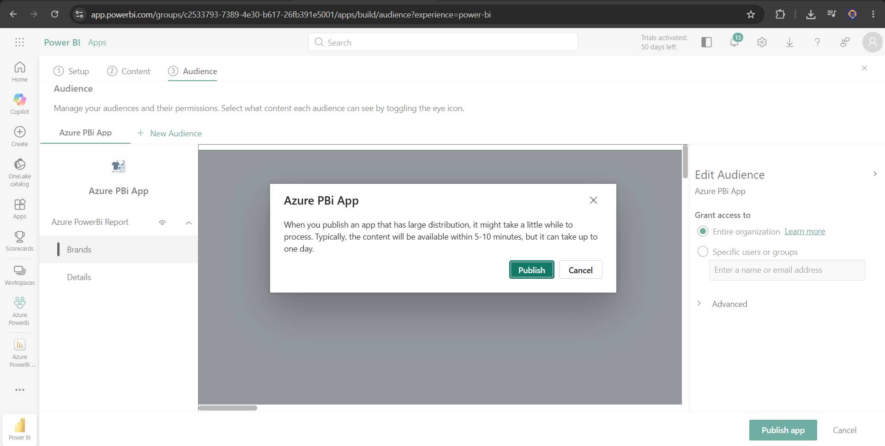

# End-to-End Azure SQL Database Analytics | Power BI Service

An end-to-end Business Intelligence project demonstrating how **Azure SQL Database**, **Power BI Desktop**, **Power Query**, **DAX**, and **Power BI Service** work together to build a cloud-based analytics solution.

The project showcases the complete reporting lifecycle, from importing data into Azure SQL Database to developing interactive Power BI dashboards and distributing them through Power BI Apps.

---

## 🛠 Tech Stack

<p align="left">


</p>

---

# Workflow

> *(Workflow diagram will be added here)*

---

# Project Overview

Organizations increasingly rely on cloud databases to centralize business data and enable scalable reporting solutions.

This project demonstrates how Azure SQL Database integrates with Power BI to create a modern cloud-based reporting workflow, from cloud data storage and SQL-based data preparation to dashboard development, deployment, and report sharing.

---

# Business Problem

A retail organization wants to centralize its product sales data inside a cloud database and provide business users with an interactive reporting solution that can be securely shared across teams.

The reporting solution should:

- Store business data in Azure SQL Database
- Perform SQL-based data preparation
- Build interactive dashboards
- Publish reports to Power BI Service
- Share reports using Power BI Apps

---

# Solution

The solution follows a complete cloud analytics workflow:

- Upload CSV dataset into Azure SQL Database
- Clean and prepare data using SQL
- Connect Power BI Desktop to Azure SQL Database
- Transform data using Power Query
- Create business KPIs using DAX
- Design an interactive two-page dashboard
- Publish reports to Power BI Service
- Create a Power BI App for report distribution

---

# Business Value

This solution provides:

- Centralized cloud database
- Secure cloud connectivity
- Interactive business reporting
- Easy report distribution
- Reduced dependency on local files
- Scalable analytics workflow

---

# Key Cloud Capabilities

- Azure SQL Database Integration
- SQL Data Cleaning
- Cloud Database Connectivity
- Power Query Transformations
- DAX Measures
- Interactive Dashboard Development
- Power BI Service Deployment
- Power BI App Publishing

---

# Dashboard Preview

## Brand Performance Overview

Provides an overview of:

- Total Products
- Average Sales Price
- Average Profit %
- Average Discount %
- Brand Performance Comparison



---

## Brand Analytics

The second report page analyzes:

- Top 5 Brands by Average Discount
- Top 5 Brands by Product Variety
- Top 5 Brands by Average Sales Price
- Top 5 Brands by Average Profit
- Bottom 5 Brands by Profit %

---

# Cloud Database Implementation

The project demonstrates:

- Azure SQL Server Creation
- Azure SQL Database Creation
- CSV Import into Azure SQL Database
- SQL-based Data Cleaning
- Secure Power BI Connectivity

---

# Power BI Development

### Data Preparation

- Power Query
- Data Cleaning
- Data Transformation
- Custom Columns

### Analytics

- DAX Measures
- Profit %
- Discount %
- Business KPIs

### Visualization

- KPI Cards
- Bar Charts
- Donut Charts
- Ribbon Charts
- Area Charts
- Interactive Filters

---

# Cloud Deployment

The completed solution was deployed through:

- Power BI Service
- Workspace Publishing
- Power BI App Creation
- Cloud-based Report Sharing

---

# Project Screenshots

## Azure SQL Connection



---

## SQL Data Cleaning



---

## Loading Data into Power BI



---

## Publishing to Power BI Service


---

## Creating Power BI App



---

# Project Highlights

- End-to-End Azure SQL Analytics Workflow
- Azure SQL Database Integration
- SQL Data Cleaning
- Cloud Database Connectivity
- Power Query Transformations
- DAX Measures
- Interactive Dashboard Development
- Power BI Service Deployment
- Power BI App Distribution

---

# Skills Demonstrated

## Cloud Technologies

- Azure SQL Database
- Cloud Database Connectivity

## SQL

- Data Cleaning
- Data Preparation
- Query Execution

## Power BI

- Power Query
- DAX
- Dashboard Development
- Data Visualization

## Cloud Reporting

- Power BI Service
- Workspace Management
- Power BI App Publishing

---

# Repository Structure

```text
azure-sql-database-powerbi-analysis
│
├── README.md
├── BUSINESS_REQUIREMENTS.md
├── Azure PowerBi Report.pbix
├── Men+Tshirt.csv
│
└── screenshots
    ├── dashboard.png
    ├── workflow.png
    ├── sql_azure_connection.png
    ├── data_cleaning_at_azure_query_editor.png
    ├── loading_data_from_azure_sql_to_powerbi_desktop.png
    ├── publish_to_power_bi_services.png
    └── publish_powerbi_app.png
```

---

# Project Documentation

📄 **Business Requirements**

`BUSINESS_REQUIREMENTS.md`

---

# Author

**Sagar Bairwa**

📧 sagar.bairwa.tech@gmail.com

💼 LinkedIn: https://linkedin.com/in/sagarbairwa

💻 GitHub: https://github.com/sagar-bairwa

---

⭐ If you found this project helpful, consider giving it a Star.
